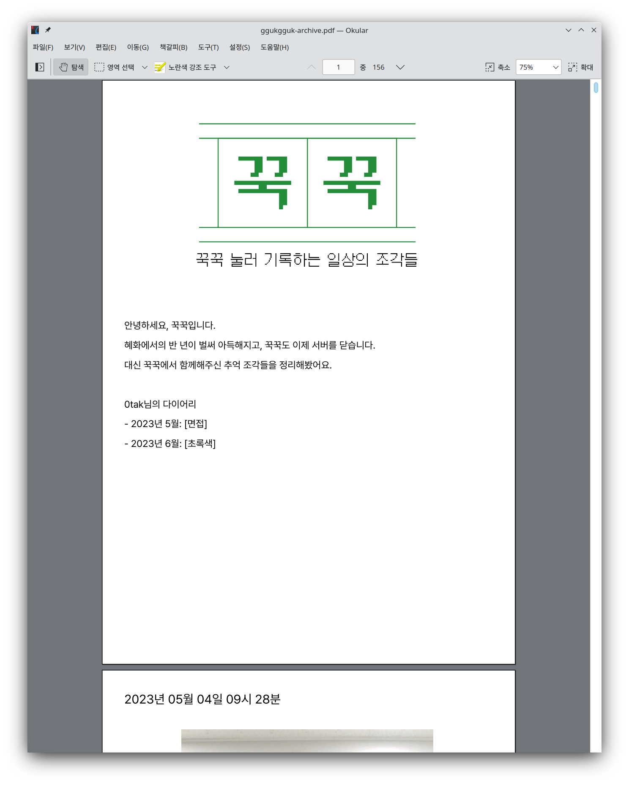

# 꾹꾹, 안녕


꾹꾹 자동 데이터 아카이빙 및 전송 스크립트

## 빌드

```sh
go build -o ./dist/
```

## 설정

```sh
cp ggukgguk-bye.toml.example ggukgguk-bye.toml
vim ggukgguk-bye.toml # MySQL 접속 정보, 진행할 배치 단계, 파일 경로 지정
```

## 결과


